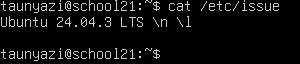
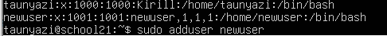
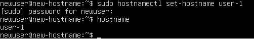
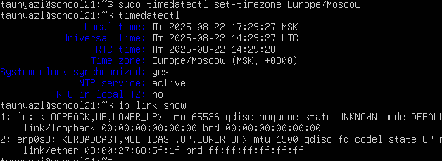
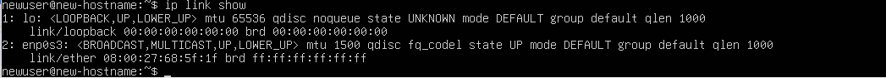
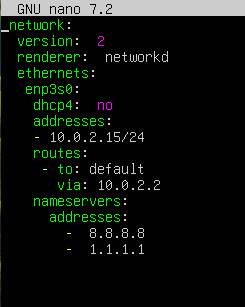

## Задание 1. Установка OC

## Задание 2. Создание пользователя

## Задание 3. Настройка сети ОС
### Выведи названия сетевых интерфейсов с помощью консольной команды.
#### В отчёте дай объяснение наличию интерфейса lo.

### Используя консольную команду, получи ip адрес устройства, на котором ты работаешь, от DHCP-сервера.

#### В отчёте дай расшифровку DHCP.

### Определи и выведи на экран внешний ip-адрес шлюза (ip) и внутренний IP-адрес шлюза, он же ip-адрес по умолчанию (gw).

### Задай статичные (заданные вручную, а не полученные от DHCP-сервера) настройки ip, gw, dns (используй публичный DNS-серверы, например 1.1.1.1 или 8.8.8.8).

### Перезагрузи виртуальную машину. Убедись, что статичные сетевые настройки (ip, gw, dns) соответствуют заданным в предыдущем пункте.

#### В отчёте опиши, что сделал для выполнения всех семи пунктов (можно как текстом, так и скриншотами).
##### Я изменил имя хоста на user-1 с помощью команды sudo hostnamectl set-hostname user-1. После этого перезагрузил систему для применения изменений.

#### Временная зона:
#### Установил временную зону Europe/Moscow командой sudo timedatectl set-timezone Europe/Moscow.

#### Названия сетевых интерфейсов:
#### Выполнил команду ip link show, получил список интерфейсов, среди которых есть интерфейс lo.

#### Успешно пропингуй удаленные хосты 1.1.1.1 и ya.ru и вставь в отчёт скрин с выводом команды. В выводе команды должна быть фраза «0% packet loss».

.PNG)

## Задание 4. Обновление ОС
 
 ### Обнови системные пакеты до последней на момент выполнения задания версии
 

## Задание 5. Использование команды sudo

### В отчёте объясни истинное назначение команды sudo (про то, что это слово — «волшебное», писать не стоит).
.PNG)
### Поменяй hostname ОС от имени пользователя, созданного в пункте Part 2 (используя sudo).

## Задание 6. Установка и настройка службы времени

### Настрой службу автоматической синхронизации времени.

#### Выведи время часового пояса, в котором ты сейчас находишься.
#### Вывод следующей команды должен содержать `NTPSynchronized=yes`: `timedatectl show`
#### Вставь скрины с корректным временем и выводом команды в отчёт.

## Задача 7. Установка и использование текстовых редакторов

**Используя каждый из трех выбранных редакторов, создай файл test_X.txt, где X — название редактора, в котором создан файл. Напиши в нём свой никнейм, закрой файл с сохранением изменений.**

**Nano:**
**Открыл файл командой nano test_Nano.txt, ввёл никнейм, затем нажал `Ctrl + O` , чтобы сохранить, и `Ctrl + X`, чтобы выйти.**

**Vim:**
**Открыл файл командой vim `test_Vim.txt`, перешёл в режим вставки `(i)`, ввёл никнейм, затем нажал `Esc`, набрал `:wq` и нажал `Enter` для сохранения и выхода.**

**MC:**
**Запустил Midnight Commander, открыл редактор `F4`, ввёл никнейм, сохранил изменения через `F2` и подтвердил сохранение.** 

**Используя каждый из трех выбранных редакторов, открой файл на редактирование, отредактируй файл, заменив никнейм на строку «21 School 21», закрой файл без сохранения изменений.**

[Image](./Image/Задача%207_mc_Замена.PNG)

[Image](./Image/Задача%207_nano_Замена.PNG)

[Image](./Image/Задача%207_vim_Замена.PNG)

**Nano:**
**Открыл файл командой nano `test_Nano.txt`, внес изменения, затем нажал `Ctrl + X`, при запросе о сохранении выбрал `N` для выхода без сохранения.**

**Vim:**
**Открыл файл командой `vim test_Vim.txt`, перешёл в режим вставки `(i)`, заменил никнейм, затем нажал `Esc` и набрал `:q!`, чтобы выйти без сохранения.**

**MC:**
**Запустил Midnight Commander, открыл файл через `F4`, внес изменения, затем нажал `F2`, при запросе о сохранении выбрал "No" для выхода без сохранения.**

**Используя каждый из трех выбранных редакторов, отредактируй файл ещё раз (по аналогии с предыдущим пунктом), а затем освой функции поиска по содержимому файла (слово) и замены слова на любое другое.**

[Image](./Image/Задача%207_nano_новое%20слово.PNG)

[Image](./Image/Задача%207_vim_новое%20слово.PNG)

[Image](./Image/Задача%207_mc_новое%20слово.PNG)

**Nano:**
**В Nano нажмите `Ctrl + \` `(или Alt + R)`, чтобы начать замену.**
**Введите слово для замены.**
**Введите новое слово.**
**Подтвердите замену по необходимости.**

**Vim:**
**Перейдите в режим вставки `(i)` и внесите изменения.**
**Выйдите из режима вставки `(Esc)`.**

**Mc:**
**Откройте файл через `F4`.**
**Внесите изменения — замените никнейм на «21 School 21».**
**Для выхода без сохранения нажмите `F2`, выберите "No" при запросе о сохранении.**

## Задача 8. Установка и базовая настройка сервиса SSHD

**Добавь автостарт службы при загрузке системы.**

**Перенастрой службу SSHd на порт 2022.**

**Используя команду `ps`, покажи наличие процесса sshd. Для этого к команде нужно подобрать ключи.**

**Вывод команды `netstat -tan` должен содержать**  
**`tcp 0 0 0.0.0.0:2022 0.0.0.0:*` LISTEN**

## Задача 9. Установка и использование утилит top, htop

### Установи и запусти утилиты top и htop.
*uptime.
*количество авторизованных пользователей.**
*среднюю загрузку системы.
*общее количество процессов.
*загрузку cpu.
*загрузку памяти.
*pid процесса, занимающего больше всего памяти.
*pid процесса, занимающего больше всего процессорного времени.

## Задача 10. Использование утилиты fdisk

**Запусти команду `fdisk -l`.**

## Задача 11. Использование утилиты df.

**Запусти команду `df`.**

**Запусти команду `df -Th`.**

## Задача 12. Использование утилиты du.

**Запусти команду du.**

**Выведи размер папок /home, /var, /var/log (в байтах, в человекочитаемом виде)**.

Выведи размер всего содержимого в /var/log (не общее, а каждого вложенного элемента,используя )

## Задача 13. Установка и использование утилиты ncdu

**Установи утилиту ncdu.**

**Выведи размер папок /home, /var, /var/log.**

## Задача 14. Работа с системными журналами

**Открой для просмотра:**

**1. /var/log/dmesg**

**2. /var/log/syslog**

**3. /var/log/auth.log**

## Задча 15. Использование планировщика заданий CRON.

**Используя планировщик заданий, запусти команду uptime через каждые 2 минуты.**

**Удали все задания из планировщика заданий.**

